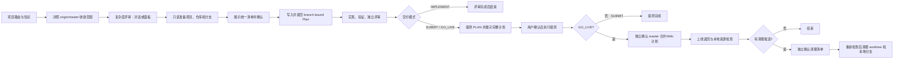

# Zan Workflows 团队使用指南

`zan-workflows` 是一组面向研发日常的 Codex Skills 和 MCP 连接。它把 TAPD 需求/Bug、代码范围确认、分支、Plan、实现评审、提测、Wiki、GitLab MR、上线和本地清理串成有明确交接与确认点的流程。

本文适合首次安装的团队成员。MCP 凭据按个人账号配置在本机；不要把凭据提交到仓库或发到聊天中。

## 主要流程入口

团队日常研发优先从下面两个编排入口开始。它们负责选择并串联专用能力；其他 Skill 通常由入口按阶段调用，也可以按需单独使用。

| Codex 显示名称 | 调用方式 | 适用场景 |
| --- | --- | --- |
| **zan:需求开发** | `$developing-requirement` | TAPD Story/Task：范围确认 → 分支与 Plan → 实现评审 → 按要求提测/上线 |
| **zan:修复 TAPD 缺陷** | `$fixing-bug` | 一个或多个 TAPD Bug：统一预检和确认 → 顺序修复/提测 → 明确要求时上线 |

## 1. 能力地图

| Codex 显示名称 | Skill ID | 作用 | 类型 |
| --- | --- | --- | --- |
| zan:项目知识 | [`workspace-project-knowledge`](skills/workspace-project-knowledge/SKILL.md) | 根据业务词、仓库、服务名或页面/API 线索定位项目，读取项目知识，查 Jenkins Job 和共享包归属 | 项目路由/知识入口 |
| zan:准备 TAPD 工作 | [`preparing-work`](skills/preparing-work/SKILL.md) | 只读读取 TAPD Bug、Story、Task，确认项目、仓库、范围、原始分支及创建/复用动作，输出内存交接定义 | 只读预检 |
| zan:可视化编写计划 | [`writing-plans`](skills/writing-plans/SKILL.md) | 按远程 `origin/master` 收敛需求和验收；简单需求用对话，复杂需求用评审面板；绑定分支后写可执行 Plan | 范围/Plan |
| zan:实施 TAPD 工作 | [`implementing-work`](skills/implementing-work/SKILL.md) | 在已确认的固定分支实现变更，运行相关验证并独立评审；不负责提测或发布 | 实现/评审 |
| **zan:需求开发** | [`developing-requirement`](skills/developing-requirement/SKILL.md) | 编排一个 TAPD Story/Task 从范围、分支、Plan、实现到用户明确选择的提测或上线阶段 | 需求主入口 |
| **zan:修复 TAPD 缺陷** | [`fixing-bug`](skills/fixing-bug/SKILL.md) | 对一个或多个 Bug 做统一只读预检、清单确认，按顺序修复和提测；用户明确要求时可继续上线 | Bug 主入口 |
| zan:起草提测 Wiki | [`drafting-wiki`](skills/drafting-wiki/SKILL.md) | 只读定位现有提测 Wiki 或计算新 Wiki 正文，不直接写入 | Wiki 规划 |
| zan:补写提测 Wiki 链接 | [`linking-tapd-wiki`](skills/linking-tapd-wiki/SKILL.md) | 将已验证的提测 Wiki 链接幂等地添加到或核对 TAPD Bug、Story、Task 评论 | TAPD 评论 |
| zan:提交测试 | [`submitting-for-test`](skills/submitting-for-test/SKILL.md) | 在提测计划确认后，负责代码交付到 `develop`、可选 Jenkins 测试部署、Wiki、TAPD 评论/状态/测试版本 | 提测执行 |
| zan:上线发布 | [`going-live`](skills/going-live/SKILL.md) | 将原始开发分支合并到 `master`，维护 Wiki 合并状态；验证后生成本地清理计划，并在另行确认后清理 worktree/本地分支 | 上线/清理 |
| zan:管辖 MR 审核 | [`managed-mr-review`](skills/managed-mr-review/SKILL.md) | 查找、审核和按明确要求合并管辖范围内 GitLab MR；代码结论和合并资格分别判断 | MR 管理 |
| zan:团队身份映射 | [`team-identity-map`](skills/team-identity-map/SKILL.md) | 根据已知姓名、企微线索或 GitLab 用户名查询团队身份映射 | 身份查询 |
| zan:登录令牌工作流 | [`login-token-workflow`](skills/login-token-workflow/SKILL.md) | 获取测试环境商家后台/C 端调试 token 并组装本地调试 URL | 本地调试 |
| zan:项目记忆上下文 | [`project-memory-context`](skills/project-memory-context/SKILL.md) | 需要历史决策或旧问题上下文时检索有限的 AI 会话记忆，并以当前代码和证据复核 | 历史上下文 |

主流程入口负责组织顺序和收集确认；具体能力由专用 Skill 执行。多数交接只保存在当前对话内存，不创建额外的流程状态文件。

### 一次执行提测 Wiki 与评论

提测计划已确认、Wiki 正文已审阅后，可从插件根目录运行一个脚本完成
“需求详情 → 评论 → 复用已有链接或定位月份父页并创建 → 读回 → 评论写回”。
脚本复用 `tapd-mcp` 的本机凭证；不接受 token 参数。默认只读预览，
加 `--execute` 才会创建 Wiki/评论。原分支用于核对 Wiki 归属。

```bash
node skills/submitting-for-test/scripts/ensure-test-wiki.mjs \
  --tapd-url '<TAPD Story/Task/Bug 详情 URL>' \
  --source-branch '<已确认的原始 feature/fixbug 分支>' \
  --creator '<TAPD 创建人>' \
  --body-file '<已批准 Wiki 正文文件>' \
  --wiki-title 'MM-DD: 中文简述' --json
```

确认预览与提测计划一致后，使用同一命令加
`--expect-target <预览中的 target> --execute`。编排流程可直接用已确认
计划中的 target 一次执行；目标或月份 ID 变化时脚本会在写入前停止。
评论已有匹配
Wiki 时，只需完整 TAPD URL 和原分支，脚本返回 `ALREADY_LINKED`
且不写入。`bug`、`tasks` 也可作为 `--entry-type`。同名月份只按返回的
`parent_wiki_id` 在本地判定；脚本不会扫描全工作区 Wiki。功能性
`CONTINUE` 需要改已有 Wiki 正文时，仍走技能的最小补丁流程。默认根页
`1150372234001008260` 只适用于空间 `50372234`；其他空间创建时必须
提供已验证的 `--root-wiki-id`。

### 集中项目知识库

除插件外，团队工作流还会读取独立的 `project-knowledge` 知识库。它不是随插件打包的副本，也不是 MCP；它提供项目归属、仓库路径、Jenkins Job、服务类型、代码上下文和 Graphify 索引等团队事实。没有它时，部分 Skill 只能使用插件内的有限回退资料，结果可能不完整。

`workspace-project-knowledge` 是读取入口；需求开发、Plan、提测和 MR 审核等 Skill 会按任务通过它查项目事实。具体项目资料由 Skill 按当前任务选择，团队成员不需要逐项目配置。

#### 团队成员需要准备什么

1. 将知识库项目检出到本机工作区的 `project-knowledge` 目录：

   ```bash
   cd /path/to/workspace
   git clone http://git.jubaozan.cn/chenfangjie/project-knowledge.git project-knowledge
   ```

2. 首次使用时，在知识库项目目录安装依赖：

   ```bash
   cd /path/to/workspace/project-knowledge
   npm install
   ```

3. 运行统一初始化命令：

   ```bash
   cd /path/to/workspace/project-knowledge
   npm run init
   ```

   按提示选择 Codex、Claude Code、Gemini CLI 中一个或多个平台，并输入本机 `WORKSPACE_ROOT`。初始化会把 `WORKSPACE_RULE_LOADING_RULE.md` 中的路径写入对应的用户级提示词文件，再同步工作区开发规范；Codex 还会安装 Git 安全 Hook。执行前会展示目标路径和处理方式。提示词文件已存在时，可选择覆盖、追加或跳过。

   只需要重新同步工作区开发规范时，也可以单独运行：

   ```bash
   npm run agent-rules:install -- --workspace /path/to/workspace --platform codex
   ```

4. 经常更新本地知识库，保持项目归属、上下文和团队规范与当前仓库状态一致；拉取更新后，如果用户提示词模板或工作区规则有变化，再运行 `npm run init` 同步：

   ```bash
   git -C /path/to/workspace/project-knowledge pull --ff-only
   cd /path/to/workspace/project-knowledge
   npm run init
   ```

## 2. 需求开发流程

Story/Task 使用 `developing-requirement`。它要求一个准确的 TAPD Story/Task URL；只有 PRD 或原型、没有 TAPD 项时，流程会停在待补 TAPD 身份状态。



`delivery_mode` 可以是：

- `PLAN_ONLY`：确认范围、分支和 Plan。
- `BRANCH_ONLY`：只创建或选择分支并读回。
- `IMPLEMENT`：实现、验证和评审后结束。
- `SUBMIT`：在实现评审后进入提测流程。
- `GO_LIVE`：在提测后继续进入 `going-live`；“上线”在此指原分支合并 `master` 并维护 Wiki 状态，不表示发布生产版本。

初始需求清单的确认只授权清单中列出的范围、分支动作、Plan 和实现。提测、合并 `master`、Wiki 写入和本地清理都要等各自的精确计划展示后再确认。

需求分支格式为 `feature/<branch-owner>.<MMDD>.<短ID>.<描述slug>`。作者标识优先取目标仓库生效的 Git `user.name`，再取 Git 邮箱前缀，最后取本机用户名；身份无法安全规范化时会暂停并要求补充，不会硬编码某个同事的名字。

## 3. Bug 修复流程

Bug 使用 `fixing-bug`。它可以接收一个 Bug URL 或有序列表；多个 Bug 共用一个已确认的项目、仓库和分支。

1. `preparing-work` 对所有 Bug 做只读预检。
2. 一次性展示项目/仓库、固定分支、修复范围、提测策略、部署选择和待确认项。
3. 用户确认后，逐个刷新预检并调用 `implementing-work`。
4. 评审通过后，`submitting-for-test` 先展示完整 `SubmissionPlan` 并停止；之后只有针对未变化计划的确认才进入执行。
5. 用户明确要求上线时，才对已提测结果调用 `going-live`。master 合并/Wiki 确认独立于修复和提测确认。
6. 多 Bug 共用分支时，清理计划等队列全部处理完后再汇总，避免提前删除后续 Bug 仍要使用的环境。

`CONTINUE` 表示继续原 Bug：复用原分支和已有 Wiki，只处理增量范围；若 Bug 已在“待测试”，不重复切换状态或重复写测试版本。

## 4. 提测、Wiki 评论和上线边界

### 提测与 Wiki

`submitting-for-test` 有两种策略：

- `STANDARD`：读取并复用已有 Wiki；没有关联页面时按固定层级规划月页/子页面。执行计划确认后，写 Wiki 并读回。
- `NO_WIKI`：不调用 Wiki 能力，不创建/读取/更新 Wiki，也不写 Wiki 链接评论。

部署选项为 `DEPLOY|SKIP`。`DEPLOY` 要求准确的 Jenkins Job 和参数，并等待成功及构建 SHA 证据；`SKIP` 不调用 Jenkins。普通“提测”没有项目级部署策略时走直接提测选择。

在 `STANDARD` 且最终 Wiki 页面已验证时，提测流程会调用 `linking-tapd-wiki`，对 Bug、Story 或 Task 检查历史评论后写入或确认唯一的 Wiki 链接。固定格式是：

```text
提测wiki：[https://www.tapd.cn/{workspace_id}/markdown_wikis/show/#{wiki_id}](https://www.tapd.cn/{workspace_id}/markdown_wikis/show/#{wiki_id})
```

相同 Wiki ID 已经出现在评论中时返回 `ALREADY_LINKED`，不会重复写；若评论中关联到不同提测 Wiki，会阻塞并要求处理冲突。独立调用 `linking-tapd-wiki` 时，`PLAN` 只展示评论并等待确认；确认后 `EXECUTE` 才写入并读回。提测编排内则复用已确认的完整 SubmissionPlan。

提测目标是 `develop`。Wiki 评论完成后才继续适用的 TAPD“待测试”状态和测试版本写入，并逐项读回。任一依赖失败时停止后续写入并如实报告已完成部分。

### 合并 master 与本地清理

`going-live` 只接受原始 `feature/*` 或 `fixbug/*` 分支，并直接合并到 `master`；不把 `develop`、`dev`、`merge/*` 或重建分支作为源。业务项目在 master 包含性通过后将 Wiki“是否上线”更新为“已合并”；工具类项目维持“无需上线”。该状态只证明代码已进入 master，不代表生产发布。

合并成功后先做本地只读检查，将关联资源标为可清理候选、保留或待核实。发现候选时，必须展示准确的 worktree 路径、本地分支和目标 SHA，单独取得清理确认，再刷新检查。只用普通 `git worktree remove` 和 `git branch -d`；不删除远程分支，也不强制删除。当前任务目录/分支、保护分支、脏/活跃/锁定或证据不完整的资源不得清理。

## 5. MCP 与本地配置

插件通过 [`.mcp.json`](.mcp.json) 启动 4 个 STDIO MCP。`scripts/start-mcp.mjs` 从本机凭据文件读取配置，并只向对应服务进程注入其所需环境变量。

| MCP | 用途 | 必需配置字段 |
| --- | --- | --- |
| `tapd-mcp` | TAPD Bug/Story/Task、评论、状态、测试版本、Wiki | `TAPD_ACCESS_TOKEN`、`TAPD_API_BASE_URL`、`TAPD_BASE_URL` |
| `gitlab-mcp` | 项目、MR、diff、pipeline、审批和远程合并 | `GITLAB_API_URL`、`GITLAB_PERSONAL_ACCESS_TOKEN` |
| `jenkins-mcp` | Job 查询、触发与跟踪测试构建 | `MCP_JENKINS_URL`、`MCP_JENKINS_USER`、`MCP_JENKINS_API_TOKEN` |
| `yapi-mcp` | YApi 项目、接口及请求/响应契约查询 | `YAPI_BASE_URL`，以及 `YAPI_PROJECT_TOKEN` 或 `YAPI_USERNAME` + `YAPI_PASSWORD` |

### 环境要求

- Node.js 22，且 `node` 位于 Codex 可用的 `PATH`。
- Volta 和 Node.js 22.20.0，用于三个 npm MCP 的固定启动方式。
- `uv`/`uvx`，用于 TAPD MCP。
- 可访问公司服务、公司 npm 源，以及所需 npm/Python 包下载源。

Windows 使用 `volta.exe`/`uvx.exe`；启动器不经过 Bash 或 shell 拼接命令。MCP 未配置时，该服务启动报出缺少字段，其它独立 MCP 不受影响。

### 创建个人凭据文件

把 [`credentials.example.json`](references/credentials.example.json) 复制为当前用户的配置文件，并由本人填写有权限的凭据：

| 平台 | 默认路径 |
| --- | --- |
| macOS | `~/.config/zan-workflows/credentials.json` |
| Windows | `%USERPROFILE%\.config\zan-workflows\credentials.json` |
| Linux | `~/.config/zan-workflows/credentials.json` |

文件结构如下。请从示例文件复制实际完整结构；这里只展示结构和字段名，不要填写真实凭据到团队文档：

```json
{
  "version": 1,
  "servers": {
    "gitlab-mcp": { "env": { "GITLAB_API_URL": "", "GITLAB_PERSONAL_ACCESS_TOKEN": "" } },
    "jenkins-mcp": { "env": { "MCP_JENKINS_URL": "", "MCP_JENKINS_USER": "", "MCP_JENKINS_API_TOKEN": "" } },
    "tapd-mcp": { "env": { "TAPD_ACCESS_TOKEN": "", "TAPD_API_BASE_URL": "", "TAPD_BASE_URL": "" } },
    "yapi-mcp": { "env": { "YAPI_BASE_URL": "", "YAPI_USERNAME": "", "YAPI_PASSWORD": "" } }
  }
}
```

也可以设置 `ZAN_WORKFLOWS_CONFIG` 指向另一个绝对路径。macOS/Linux 建议凭据目录权限为 `700`、文件权限为 `600`；Windows 应限制文件 ACL。YApi 可以用 `YAPI_PROJECT_TOKEN` 代替用户名/密码登录。

配置完成后，在插件根目录执行配置检查：

```bash
node scripts/start-mcp.mjs gitlab-mcp --check
node scripts/start-mcp.mjs jenkins-mcp --check
node scripts/start-mcp.mjs tapd-mcp --check
node scripts/start-mcp.mjs yapi-mcp --check
```

`--check` 只验证本机文件和必需字段，不启动服务，也不验证远端连通性。首次调用外部系统时还需要确认 MCP 已连接、凭据有效且账号权限满足操作要求。

工具路由优先使用专用 MCP；本地源码、Git 状态和 commit 使用本地 Git CLI。MCP 缺少能力时才评估官方 API/受控 CLI；不能静默改用浏览器写 TAPD、GitLab 或触发 Jenkins。

## 6. 安装与升级

团队通过仓库内 [`../../.agents/plugins/marketplace.json`](../../.agents/plugins/marketplace.json) 提供的 `cfj-skills` marketplace 安装。Codex 官方文档支持从 Git marketplace 源安装，也支持只检出 marketplace 目录。

```bash
codex plugin marketplace add cfj1996/skills --sparse .agents/plugins
codex plugin marketplace list
codex plugin add zan-workflows@cfj-skills
```

如果仓库是私有的，先确保本机 GitHub 凭据可以读取该仓库。更新时刷新 marketplace 后安装当前版本：

```bash
codex plugin marketplace upgrade cfj-skills
codex plugin add zan-workflows@cfj-skills
```

安装或升级后，重新启动 Codex/插件环境并新建一个 task，以加载最新 Skill 和 MCP。MCP 凭据是本机文件，升级插件不会覆盖凭据。团队也可由管理员在 ChatGPT workspace 发布并按角色授权；该方式与 Git marketplace 分发不同，需 workspace admin 权限。

此插件还含两个生命周期 Hook：SessionStart 在可用时调用 `ai-session-memory` 更新会话触点；PreToolUse 检查 Bash Git 命令中的分支安全规则。安装后在 Codex 中审阅并信任这些 Hook，再验证行为。

## 7. 常用调用示例

将 TAPD 链接和明确意图直接写在任务里：

```text
使用 $developing-requirement 开发这个 TAPD Story：<TAPD URL>。先确认范围和 Plan，完成实现评审后提测，测试环境部署选择 SKIP。

使用 $fixing-bug 修复这个 TAPD Bug：<TAPD URL>。使用项目 X 的仓库和 fixbug/... 分支，走 STANDARD Wiki，跳过测试环境部署。

使用 $linking-tapd-wiki 为这个 TAPD Task 补上已有提测 Wiki 链接：<TAPD URL>，Wiki：<已确认的 Wiki URL>。

使用 $managed-mr-review 查找并审核我管辖项目中目标分支为 master 的 MR。先只审核，不要合并。
```

权限敏感的阶段会先展示具体对象、分支、目标、写入内容和用途，再等待对应确认。不要把一次“继续”视为对后续不同阶段的通用授权。

## 8. 欢迎提交 Issue

欢迎大家提交问题、补充需求和改进建议。请按问题归属选择仓库，避免插件逻辑问题和团队项目事实混在同一处：

| 反馈内容 | 提交位置 |
| --- | --- |
| Skill 误触发、流程顺序/确认门禁不正确、Wiki 评论/提测/上线行为异常、MCP 启动或凭据配置说明错误、插件文档问题 | [zan-workflows 插件 Issues](https://github.com/cfj1996/skills/issues) |
| 项目路径或归属错误、服务名/Jenkins Job 映射错误、项目上下文过期、Graphify/路由索引缺漏、MR 管辖配置问题 | [project-knowledge Issues](http://git.jubaozan.cn/chenfangjie/project-knowledge/issues) |

提交时尽量包含以下信息，便于复现和定位：

- 受影响的 Skill、项目/模块和插件版本（若是插件问题）。
- 触发问题的请求或最小复现步骤，以及预期结果和实际结果。
- 知识库问题请指出具体文件/字段，并附上能证明正确事实的项目文档或代码位置。
- 附上已脱敏的错误信息；不要提交 TAPD/GitLab/Jenkins/YApi token、密码、个人隐私或客户数据。

也欢迎通过 Pull Request / Merge Request 修复文档、Skill 规则或知识库事实；涉及项目事实时，请在变更中附上来源依据。

## 9. 故障排查

| 现象 | 检查方式 |
| --- | --- |
| Skill 没出现或仍按旧规则工作 | 检查插件是否启用；更新 marketplace/插件并新建 task |
| MCP 报缺少字段 | 检查 `credentials.json` 中相应 `servers.<mcp>.env` 必填字段；使用对应 `--check` |
| MCP 启动失败 | 检查 Node/Volta/uvx 是否在 PATH、网络/公司 npm 源、服务 URL 和本机账号权限 |
| 有独立 MCP 注册但插件 MCP 未接管 | Codex 独立配置可能覆盖插件同名 MCP；按 [MCP 设置与迁移说明](references/mcp-setup.md) 核对注册和连接状态 |
| 提测 Wiki 评论冲突 | 检查 TAPD 历史评论是否已关联另一个 Wiki；流程不会自动追加第二个冲突链接 |
| 清理计划没有执行 | 检查是否单独确认了列出的 worktree/分支，确认后候选事实仍须完全一致 |

MCP 配置、凭据字段和迁移细节见 [`references/mcp-setup.md`](references/mcp-setup.md)。

## 10. 相关目录

```text
plugins/zan-workflows/
├── .codex-plugin/plugin.json  插件展示信息和版本
├── .mcp.json                 MCP 启动入口
├── scripts/start-mcp.mjs     凭据读取、字段隔离和 MCP 启动器
├── references/               MCP、工具路由、模型路由与凭据示例
├── hooks/                     Git 安全和会话记忆生命周期 Hook
└── skills/                    14 个可独立调用或由主入口编排的 Skills
```

Codex 插件 marketplace 的官方说明见 [Package your plugin – OpenAI Developers](https://developers.openai.com/plugins/build/plugins)。
