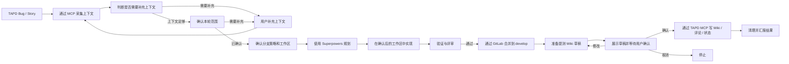

# TAPD 工作流参考

`SKILL.md` 是唯一权威执行契约。本文件只展开流程图和阶段细节，不另起一套规则。

## 流程图

## 阶段补充

### 采集上下文

- 使用 `tapd-mcp` 读取 TAPD 详情、评论、附件、PRD 和补充文档。
- 出现原型链接时，读取默认展示的需求文档。
- 采集结果保留在当前上下文，不创建 TAPD 专属过程文件。
- Bug 必采字段包括 `id`、`title`、`status`、`priority`、`severity`、`current_owner`、`reporter`、`te`、`de` 和 `created`。
- Story 的测试人员来自 `custom_field_two`；只有该字段为空时才使用 `reporter` 兜底。

### 补充上下文

- TAPD 描述不清楚时，先列出缺失信息，再向用户提出具体补充问题。
- 常见缺口包括复现路径、期望行为、影响范围、验收口径、关联分支、测试人员、原型说明和历史修复关系。
- 用户补充内容必须纳入当前上下文，并标明来源为“用户补充”。
- 补充信息改变判断时，先更新摘要，再确认本轮范围。
- 上下文仍不足时，不得进入规划。

### 确认范围

- 必须明确 `本轮处理`、`本轮不处理` 和 `历史内容处理策略`。
- 历史内容默认排除，除非用户明确纳入。
- 未出现在 `本轮处理` 中的内容，不得进入实现、验证、合并说明或 Wiki 正文。

### 开发执行阶段（内部子流程）

内部顺序固定为：分支确认子流程 -> 规划子流程 -> 实现子流程 -> 验证子流程。

### 分支确认子流程

- 详细规则见：[branch-worktree-strategy.md](branch-worktree-strategy.md)

### 规划子流程（Superpowers 路由）

- 先做场景判定，再选择技能，禁止笼统写“进入 Superpowers”。
- 需求不清或方案分歧：`superpowers:brainstorming` -> `superpowers:writing-plans`。
- Bug/异常且根因不清：`superpowers:systematic-debugging` -> `superpowers:writing-plans`。
- 方案已清晰且任务可拆：`superpowers:subagent-driven-development`；任务串行时使用 `superpowers:executing-plans`。
- 任一改代码任务都要落实 `superpowers:test-driven-development`；完成前执行 `superpowers:verification-before-completion`。
- 规划子流程产出至少包含：场景判定、技能选择理由、影响范围、测试策略、合并预期。

### 实现子流程

- diff 必须限制在已确认的本轮范围内。
- 功能和 Bug 修复遵循 `superpowers:test-driven-development`。
- 如果本轮实际生成了 Superpowers 文档，提交代码时必须一并提交相关文档。
- 提交信息使用中文 Conventional Commits。

### 验证子流程（评审）

- 声称完成前运行 `superpowers:verification-before-completion`。
- 按当前范围、当前计划/证据和本次 diff 做评审。
- `REVIEW_PASSED` 是合并前置条件。

### 合并到 develop

- 提交后确认合并条件。
- 合并条件只按本轮提交范围判断；合法来源分支相对 `develop` 多出的历史提交属于继承基线差异，应记录但不阻断。
- 不得因为继承基线差异而 cherry-pick 到 `origin/develop` 基线上另建开发分支。
- 通过 GitLab 合并到 `develop`。
- 合并成功是准备提测 Wiki 的前置条件。

### 准备提测 Wiki

- 严格按 [test-wiki.md](test-wiki.md) 执行。
- `服务名称` 必须通过 `company-project-routing` 解析。
- 写入前必须读取月目录。
- TAPD 写入前必须向用户展示完整 Wiki 草稿。

### 写回 TAPD

- TAPD 写入必须获得用户明确确认。
- Bug 评论格式固定为 `提测wiki：[wiki链接]({wiki链接})`。
- Wiki、评论、状态写入尽量合并为一次确认。

### 清理

- 确认 GitLab 合并、TAPD 写回和 worktree 清理。
- 汇报最终结果和剩余风险。

## 回归

工作流规则调整后，执行 [regression-scenarios.md](regression-scenarios.md) 中的场景，并同步修正偏离 `SKILL.md` 的阶段提示词。
