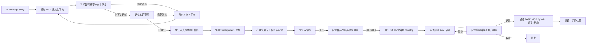

# TAPD 工作流参考

`SKILL.md` 是唯一权威执行契约。本文件只展开流程图和阶段细节，不另起一套规则。

## 流程图

## 阶段补充

### 采集上下文

- 使用 `tapd-mcp` 读取 TAPD 详情、评论、附件、PRD 和补充文档。
- 出现原型链接时，读取默认展示的需求文档。
- 采集结果保留在当前上下文，不创建 TAPD 专属过程文件。
- Bug 必采字段包括 `id`、`title`、`status`、`priority`、`severity`、`current_owner`、`reporter`、`te`、`de` 和 `created`。
- 测试人员解析规则统一参见 [collector.md](collector.md)；严禁在此处硬编码任何字段映射。

### 补充上下文

- TAPD 描述不清楚时，先列出缺失信息，再向用户提出具体补充问题。
- 常见缺口包括复现路径、期望行为、影响范围、验收口径、关联分支、测试人员、原型说明和历史修复关系。
- 用户补充内容必须纳入当前上下文，并标明来源为“用户补充”。
- 补充信息改变判断时，先更新摘要，再确认本轮范围。
- 上下文仍不足时，不得进入规划。

### 确认范围

- 必须明确 `本轮处理`、`本轮不处理` 和 `历史内容处理策略`。
- 历史内容默认排除，除非用户明确纳入。
- 未出现在 `本轮处理` 中的内容，不得进入实现、验证、合并说明或 Wiki 正文。

### 开发执行阶段（阶段 4）

详细规则见：[development-execution.md](development-execution.md)。内部包含分支确认、规划、实现与验证环节。

### 合并到 develop
 
 - 提交后确认合并条件。
 - 合并条件只按本轮提交范围判断；合法来源分支相对 `develop` 多出的历史提交属于继承基线差异，应记录但不阻断。
 - 不得因为继承基线差异而 cherry-pick 到 `origin/develop` 基线上另建开发分支。
 - **必须先展示拟合并的分支详情和提交列表，获得用户明确确认后，再通过 GitLab 合并到 `develop`。**
 - 合并成功是准备提测 Wiki 的前置条件。

### 准备提测 Wiki

- 严格按 [test-wiki.md](test-wiki.md) 执行。
- **准备前，必须先查询 TAPD 详情与历史评论，检查是否已存在提测 Wiki 链接。若已存在，则在原页面补充，绝对禁止新建 Wiki。**
- `服务名称` 必须通过 `company-project-routing` 解析。
- 写入前必须读取对应的目标页面（月目录或已有子 Wiki）。
- TAPD 写入前必须向用户展示完整 Wiki 草稿。

### 写回 TAPD

- TAPD 写入必须获得用户明确确认。
- Bug 评论格式固定为 `提测wiki：[wiki链接]({wiki链接})`。
- Wiki、评论、状态写入尽量合并为一次确认。

### 清理

- 严格执行 `SKILL.md` 中的“工作区清理门禁”。
- 确认 GitLab 合并结果：若合并失败或有冲突，必须停在阶段 5 解决，禁止进入清理。
- 确认 TAPD 写回结果。
- 最终汇报必须包含：TAPD 链接、Wiki 链接、合并后的 SHA、清理完成声明。

## 自动化检查与回归

工作流规则调整后，执行 [regression-scenarios.md](regression-scenarios.md) 中的场景，并同步修正偏离 `SKILL.md` 的阶段提示词。
