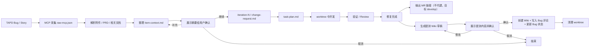

# TAPD 工作流契约

## 触发方式

- 首次处理：`/tapd-workflow <TAPD链接>`
- 继续处理：`/tapd-workflow bug item-id <ITEM_ID>` 或 `/tapd-workflow story item-id <ITEM_ID>`
- 使用 `bug|story item-id` 时，默认表示继续修复或补需求，不重新采集 `raw-mcp.json`

## 流程图

## 目录约定

- 工作文件按类型写入：
  - Bug: `docs/bugs/item-{short-id}/`
  - Story: `docs/stories/item-{short-id}/`
- `raw-mcp.json` 和 `item-context.md` 保留在 `item-{short-id}` 根目录
- 每次实际执行使用新的 `iteration-{N}/` 子目录，保存当前轮次的 `change-request.md`、`task-plan.md`、`impl-summary.md` 和 `review-report.md`
- `item-{short-id}` 中的 `short-id` 由 TAPD MCP 查询得到；TAPD 原始 `id` 只用于查找输入，不进入命名
- 分支命名：必须基于规划产物中的 `base_branch`（即 `origin/master`）创建。{slug} 使用中文进行简单的描述，不超过10个字
  - Bug: `fixbug/{git-user}.{YYMMDD}.{slug}-{short-id}`
  - Story: `feature/{git-user}.{YYMMDD}.{slug}-{short-id}`
- Worktree 路径：项目根目录下 `./.worktree/{短的描述}-{short-id}`
- 创建 MR 合并请求，只能合并到`develop`分支，到输出MR的链接，让用户自己手动合并

## 输出文件

- `item-context.md`
- `iteration-{N}/change-request.md`
- `iteration-{N}/task-plan.md`
- `iteration-{N}/impl-summary.md`
- `iteration-{N}/review-report.md`

## 本轮范围声明（`change-request.md` 必填）

- `iteration-{N}/change-request.md` 必须包含以下三个小节，缺一不可：
  - `本轮处理`：仅列出本轮明确要完成的需求/缺陷点
  - `本轮不处理`：明确列出本轮排除项
  - `历史内容处理策略`：固定写明“默认不自动合并历史记录；仅在用户点名后纳入本轮”
- 未出现在 `本轮处理` 的条目，不得进入 `task-plan.md`、`impl-summary.md`、`review-report.md` 或提测 Wiki 正文。
- 如果发现候选历史信息，必须在 `change-request.md` 标记为“待用户确认”，不得直接并入执行范围。

## 原型规则

- 只处理详情页正文、评论正文，以及这两处中的图片/截图信息
- 如果 TAPD 提供附件、PRD、需求说明或其他补充文档，必须在信息采集阶段一起解析，并将结论写入 `item-context.md`
- 解析补充文档时，优先识别正式需求、范围边界、验收口径、版本信息和文档间差异
- 如果附件存在但无法访问，要写明文件名、来源和不可访问原因，不能只写“附件存在”
- 首次采集后、用户确认前，如果 TAPD 又新增了附件、PRD 或补充说明，必须继续补采并更新 `item-context.md`，不能直接进入规划阶段
- 默认优先级：蓝湖 > MasterGo > Figma > 其他链接
- 只要出现原型链接，必须使用 `chrome-devtools-mcp` 打开原型文档
- 原型中的需求提取默认只读取当前展示的需求文档，不主动切换其他需求文档
- 原型分析结果必须提炼后写入 `item-context.md`
- 只有链接存在但无法访问时，才允许标记为缺失

## MCP-first 规则

- 依赖 `tapd-mcp`；所有 TAPD 读取和写入都必须通过它完成
- 如果 `tapd-mcp` 不可用，停止 workflow 并提示用户，不使用 CLI 兜底
- 详情、评论、附件和补充文档索引都直接调用 TAPD MCP 获取：
  - Bug: `mcp__mcp_server_tapd__get_bug`
  - Story: `mcp__mcp_server_tapd__get_stories_or_tasks`
- 代码提交前与提测前的基线/合并校验统一按 [`references/gitlab-map.md`](gitlab-map.md) 执行
- 采集结果按类型保存：
  - Bug: `docs/bugs/item-{short-id}/raw-mcp.json`
  - Story: `docs/stories/item-{short-id}/raw-mcp.json`
- `warnings`/`collection_confidence`（如果有）用于后续阶段判断信息完整度。
- 页面浏览仅在 MCP 无法提供核心信息时才访问。
- MCP 返回的原型/截图/附件/PRD 链接应该先通过对应可用工具读取内容，再提炼到 `item-context.md`。
- **主动确认**：在生成 `item-context.md` 后，必须向用户展示解析后的功能概要或问题复现步骤，询问“继续/补充需求/取消”。只有收到确定的指令后，才能为当前轮次准备 `change-request.md`、`task-plan.md`。
- 后续继续修复或补需求时，不重新生成 `raw-mcp.json`，而是新增 `iteration-{N}/change-request.md` 作为当前轮次输入；但若 TAPD 在首轮确认前补了新的附件/PRD，仍应回到信息采集阶段补读并更新 `item-context.md`
- 当用户输入 `/tapd-workflow bug item-id <ITEM_ID>` 或 `/tapd-workflow story item-id <ITEM_ID>` 时，先查找对应类型下的 `item-{short-id}` 目录和已有 `item-context.md`，再进入当前轮次流程。
- 任何 TAPD 写操作都必须先让用户手动确认，再调用对应 MCP 接口；包括创建/更新 Bug、Story、Comment、Wiki，以及编辑、移动、补充或改写已有内容。
- 允许把同一批次的 Wiki 创建、Bug 评论补充、状态更新合并为一次确认，不要求每一步都单独打断用户

## 处理顺序

1. 收集信息
   - 回归检查：`regression-checker` 确认采集字段完整、custom field 映射已解析、item-context 可支持下一阶段
2. 需求确认（展示摘要并询问“继续/补充/取消”，收到明确指令后方可进行后续工作）
3. 记录本轮变更 `iteration-{N}/change-request.md`
   - 回归检查：`regression-checker` 必须确认 `本轮处理/本轮不处理/历史内容处理策略` 三个小节齐全，且无越界条目后方可进入规划
4. 规划任务
   - 回归检查：`regression-checker` 确认变更范围、任务拆解、测试策略、分支与合规检查可执行
5. 实现修改
   - 回归检查：`regression-checker` 确认仅修改计划内文件、docs 产物齐全、实现未偏离范围
6. Review
   - 回归检查：`regression-checker` 确认 Review 结论、风险项、后续动作与当前轮次产物一致
7. 修复完成
   - 仅在 Review 输出 `REVIEW_PASSED` 后执行
   - 先整理当前轮次的修复结论、MR 链接和提测草稿
   - 只有进入该阶段后，才允许写入提测 Wiki、Bug 评论和 Bug 状态
8. 提交与 MR
   - Commit Message 信息使用中文，需要符合 Conventional Commits的提交规范编写描述信息
   - 提交代码前，必须调用 `gitlab-map` 验证当前分支是从 `origin/master` 创建，并记录校验明细；不通过则立即中止、不要提交，并返回修正建议（重新基于 `origin/master` 重新建分支）
   - MR 只输出链接，不代建、不代合并
   - MR 链接必须显式带 `target_branch=develop`，默认目标分支固定为 `develop`
   - MR 标题优先使用 `task-plan.md` 的摘要
   - 必须同时提交 `docs/` 下的文档，若被忽略需 `git add -f`
9. 生成提测 Wiki
   - 创建位置固定为 `提测文档`（`1150372234001008260`）下的当月目录 `YYYY-MM`
   - Wiki 名称格式为 `MM-DD: {简单描述}`
   - 必须先检查当月目录是否已有当前 TAPD 项的相关子 Wiki（按 `short-id`、分支名或既有条目关联信息判定）：
     - 若不存在：先创建 `MM-DD: {简单描述}` 子 Wiki，再进入后续补充流程
     - 若已存在：直接进入后续补充流程，不得重复创建同一 TAPD 项子 Wiki
   - 必须先按 [`references/test-wiki.md`](test-wiki.md) 生成完整 Wiki 正文，正文必须符合模板，不能改成摘要格式或简版格式
   - Wiki 模板中的 `服务名称` 必须先通过 `company-project-routing` 技能按项目线索映射获取，并在当前轮次产物中保留映射依据；不得直接沿用项目名称
   - 创建前必须使用 `gitlab-map` 查询当前分支最新提交是否已合并到 `origin/develop`（全量提交需确认已同步到该分支），仅在查询为真时允许创建提测 Wiki
   - 生成前必须先读取月目录正文，确认模块结构和已有条目顺序；若月目录已有 `# 前端` 模块，则必须在该模块末尾追加，不能整页覆盖
   - `代码分支名` 必须写真实 Git 分支名，不能写 `short-id`
   - `测试人员` 必须优先取 TAPD `custom_field_two`；若为空，才可按模板兜底 `reporter`
   - 生成后先展示给用户确认，再写入 TAPD Wiki、再将提测wiki地址写入当前 tapd 详细下的评论、最后这个 tapd 若是 bug 再修改 Bug 状态
   - 写入 Bug 评论时，内容必须仅为 `提测wiki：[wiki链接]({wiki链接})`（Markdown 可点击链接），不得额外添加说明文字
   - 如果月目录里已有按模块分组的提测文档，优先插入到 `前端` 模块中，保持模块内顺序连续；没有 `前端` 模块则先创建该模块
   - 写入前必须确认：
     - 月目录存在且已定位到正确目录
     - `# 前端` 模块的插入位置已确定
     - 序号已按当前模块内顺序计算
     - wiki 正文已完整展示给用户并获得明确确认
   - 如果任何一项无法确认，必须停止，不得自行猜测位置、序号或模板内容后直接写入
10. 收尾与清理
   - 回归检查：`regression-checker` 确认 TAPD 写回、评论、MR 链接和 worktree 清理结果都已落地，且无遗留未处理阶段

## 全局约束

- 先证据，后判断
- 范围最小化，不做无关重构
- 不自动合并历史记录；历史信息只有在用户明确点名后才允许纳入本轮
- 每个阶段都要保留可追踪的 Markdown 产物
- 涉及代码修改时，优先运行相关测试
- 同一 TAPD 项继续修复时，必须新开轮次，不覆盖历史轮次产物
- 任何阶段如无 `regression-checker` 通过，不得进入下一阶段

## 回归用例

- 规则变更后，按 [`references/regression-scenarios.md`](regression-scenarios.md) 执行 RED/GREEN 回归，确保关键门禁未退化。
