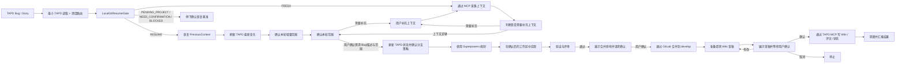

# TAPD 工作流参考

`SKILL.md` 是唯一权威执行契约。本文件只展开流程图和阶段细节，不另起一套规则。

## 流程图

```mermaid
flowchart LR
  A["TAPD Bug / Story"] --> P["最小 TAPD 读取 + 项目路由"]
  P --> R["LocalGitResumeGate"]
  R -->|RESUME| RB["恢复 PreviousContext"]
  R -->|FRESH| B["通过 MCP 采集上下文"]
  R -->|PENDING_PROJECT / NEED_CONFIRMATION / BLOCKED| RX["停下确认恢复基准"]
  RB --> B2["刷新 TAPD 最新变化"]
  B2 --> C2["确认本轮增量范围"]
  B --> C["判断是否需要补充上下文"]
  C -->|需要补充| D["用户补充上下文"]
  D --> B
  C -->|上下文足够| E["确认本轮范围"]
  C2 --> E
  E -->|用户确认需求/Bug描述与范围| F["更新 TAPD 状态并确认分支策略"]
  E -->|需要补充| D
  F --> G["使用 Superpowers 规划"]
  G --> H["在确认后的工作区中实现"]
  H --> I["验证与评审"]
  I -->|通过| J["展示合并影响并请求确认"]
  J -->|用户确认| K["通过 GitLab 合并到 develop"]
  K --> L["准备提测 Wiki 草稿"]
  L --> M["展示草稿并等待用户确认"]
  M -->|确认| N["通过 TAPD MCP 写 Wiki / 评论 /状态"]
  M -->|修改| L
  M -->|取消| X["停止"]
  N --> O["清理并汇报结果"]
```

## 阶段补充

### 采集上下文

- 进入完整采集前，必须先完成最小 TAPD 读取和项目路由，拿到 `short-id` 与目标项目仓库后，再执行 `LocalGitResumeGate`。本地 git 分支、TAPD/Wiki 分支线索和远端 ref 优先；当前工作区 `docs/{short-id}` 只作为最后的加速路径。
- 未解析目标项目仓库时，`LocalGitResumeGate` 必须停在 `PENDING_PROJECT` 或 `BLOCKED`，不得在当前 cwd 或 workspace 根目录猜测搜索。
- `git fetch origin --prune` 只允许作为 `LocalGitResumeGate` 的只读同步动作；应先查本地 refs，未命中或需要刷新时再执行，并记录到 Gate 结果。
- `LocalGitResumeGate` 命中 raw 时，进入 `RESUME`：从 `<selected_resume_ref>:docs/{short-id}/raw.md` 恢复 `PreviousContext`，再读取 TAPD 当前状态和最新评论作为 `LatestTapdRefresh`。
- 二次接入时，本轮范围必须由 `PreviousContext + LatestTapdRefresh + UserIncrement` 合成；历史需求/Bug 上下文不能被重新采集结果覆盖。
- 用户提供分支但 raw 缺失，或所有候选 ref 都缺少 raw 时，进入 `NEED_CONFIRMATION`；多候选场景必须遍历所有候选 ref，不得因第一个候选缺 raw 直接阻断。
- `LocalGitResumeGate` 结果在 raw 可写前先记录到 `update_topic`；`RESUME` 后追加到恢复出的旧 raw，`FRESH` 后写入新 raw，`PENDING_PROJECT` / `NEED_CONFIRMATION` / `BLOCKED` 时不得新建 raw。
- 使用 `tapd-mcp` 读取 TAPD 详情、评论、附件、PRD 和补充文档。
- 出现原型链接时，读取默认展示的需求文档。
- 采集成功并拿到 `short-id` 后，创建或更新 `docs/{short-id}/raw.md`，记录 TAPD id 与描述、需求/Bug 描述、流程进度和创建时间；二次接入时只能在复用分支上追加记录。
- 禁止仅因当前工作区没有 `__test___/{short-id}` 或 `docs/{short-id}` 就判定为首次开发。
- 除 `docs/{short-id}/raw.md` 外，不创建 TAPD 专属原始数据转储文件。
- Bug 必采字段包括 `id`、`title`、`status`、`priority`、`severity`、`current_owner`、`reporter`、`te`、`de` 和 `created`。
- 测试人员解析规则统一参见 [collector.md](collector.md)；严禁在此处硬编码任何字段映射。
- **状态流转同步**：每次进入新阶段或遇到门禁阻塞时，必须同步调用 `update_topic` 更新会话状态，确保摘要实时反映当前处理进度。

### 补充上下文

- TAPD 描述不清楚时，先列出缺失信息，再向用户提出具体补充问题。
- 常见缺口包括复现路径、期望行为、影响范围、验收口径、关联分支、测试人员、原型说明和历史修复关系。
- 用户补充内容必须纳入当前上下文，并标明来源为“用户补充”。
- 补充信息改变判断时，先更新摘要，再确认本轮范围。
- 上下文仍不足时，不得进入规划。

### 确认范围

- 必须明确展示需求描述、Bug 描述、`本轮处理`、`本轮不处理` 和 `历史内容处理策略`。
- 必须获得用户确认后才能进入开发执行阶段；未确认时只能继续补充上下文或调整范围。
- 历史内容默认排除，除非用户明确纳入。
- 未出现在 `本轮处理` 中的内容，不得进入实现、验证、合并说明或 Wiki 正文。

### 开发执行阶段（阶段 4）

详细规则见：[development-execution.md](development-execution.md)。内部包含分支确认、规划、实现与验证环节。
进入时必须先写回 TAPD 状态：Bug 改为“修复中”，Story/Task 改为“进行中”。计划、验证、评审和 Superpowers 过程文档必须写入 `docs/{short-id}/`；测试代码必须写入 `__test___/{short-id}/xxx.test.(js|ts)`。

### 合并到 develop
 
 - 提交后确认合并条件。
 - 合并条件只按本轮提交范围判断；合法来源分支相对 `develop` 多出的历史提交属于继承基线差异，应记录但不阻断。
 - 不得因为继承基线差异而 cherry-pick 到 `origin/develop` 基线上另建开发分支。
 - **必须先执行 `MergeConfirmationGate`**：展示拟合并的分支详情、源分支、目标分支、本轮提交列表、继承基线差异和合并目的，获得用户明确确认后，再通过 GitLab 合并到 `develop`。
 - `MergeConfirmationGate` 必须记录 `expected_source_branch`、`expected_target_branch`、`expected_commit_list`、`actual_source_branch`、`actual_target_branch`、`actual_commit_list`、`user_confirmation_text` 和 `merge_confirmation_result`。
 - `actual_source_branch`、`actual_target_branch` 或实际提交列表与 expected 不一致时，必须重新展示影响并重新获得确认。
 - 合并成功是准备提测 Wiki 的前置条件。

### 准备提测 Wiki

- 严格按 [test-wiki.md](test-wiki.md) 执行。
- **准备前，必须先查询 TAPD 详情与历史评论，检查是否已存在提测 Wiki 链接。若已存在，则在原页面补充，绝对禁止新建 Wiki。**
- 必须通过 `workspace-project-knowledge` 解析知识库中的精确 Jenkins Job 名称、Job 地址、当前项目名称和服务类型；不得使用仓库名称或服务别名替代。
- 写入前必须读取对应的目标页面（月目录或已有子 Wiki）。
- 必须先确认原开发源分支并记录 `effective_wiki_branch_name`；Wiki 的 `代码分支名` 只能写这一条 `feature/*` 或 `fixbug/*` 分支。若冲突流程通过 `merge/* -> develop` 合并，禁止把 `merge/*` 中间分支写入 Wiki。
- TAPD 写入前必须向用户展示完整 Wiki 草稿。
- Wiki 写入必须执行 `WikiWriteGate` 并在写入后读回目标页面；读回内容不包含预期补丁时不得继续写 TAPD 评论或状态。

### 写回 TAPD

- TAPD 写入必须获得用户明确确认。
- Bug 评论格式固定为 `提测wiki：[https://www.tapd.cn/{workspace_id}/markdown_wikis/show/#{wiki_id}](https://www.tapd.cn/{workspace_id}/markdown_wikis/show/#{wiki_id})`。
- 调用 `create_comments` 前必须通过 `TAPD_COMMENT_GATE`：评论正文只能由最终 Wiki 链接生成，且必须完全等于单行 `提测wiki：[https://www.tapd.cn/{workspace_id}/markdown_wikis/show/#{wiki_id}](https://www.tapd.cn/{workspace_id}/markdown_wikis/show/#{wiki_id})`。
- `TAPD_COMMENT_GATE` 必须记录 `expected_comment_body` 和 `actual_comment_body`；二者不完全相等时不得调用 `create_comments`。
- Bug 评论正文禁止追加 MR、Jenkins、构建结果、实现说明、验证摘要或任何多行说明；这些信息只允许出现在最终回复中。
- Wiki、评论、状态写入尽量合并为一次确认。

### 清理

- 严格执行 `SKILL.md` 中的“工作区清理门禁”。
- 确认 GitLab 合并结果：若合并失败或有冲突，必须停在阶段 5 解决，禁止进入清理。
- 确认 TAPD 写回结果。
- 最终汇报必须包含：TAPD 链接、需求/Bug 描述、处理范围、Wiki 链接、合并后的 SHA、单元测试结果、集成测试结果、`docs/{short-id}/raw.md` 路径、清理完成声明和剩余风险。

## 自动化检查与回归

工作流规则调整后，执行 [regression-scenarios.md](regression-scenarios.md) 中的场景，并同步修正偏离 `SKILL.md` 的阶段提示词。
