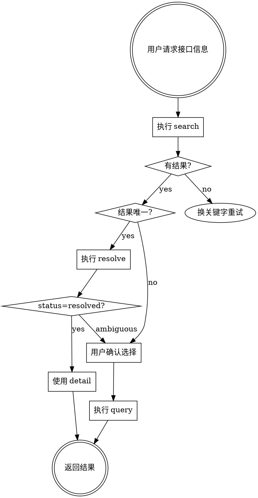

# YAPI 工作流

## 输入

- 接口名称或路径关键字
- 或接口 ID（已知时）

## 脚本调用方式

本 skill 内置 Python 脚本，直接调用：

```bash
python scripts/yapi.py <command> [options]
```

## 命令表

| 名称 | 用法 | 说明 |
| --- | --- | --- |
| `search` | `search <query>` | 全局搜索远端接口 |
| `query` | `query <id>` | 按接口 ID 查询详情 |
| `resolve` | `resolve <query>` | 搜索后自动判定唯一接口 |
| `show` | `show <id>` | `query` 的别名 |
| `gen-ts` | `gen-ts [--id <id> \| --query <text>]` | 生成 TypeScript 类型声明 |
| `server list` | `server list` | 列出所有服务映射 |
| `server get` | `server get <name>` | 获取项目的服务名 |
| `server set` | `server set <name> <serverName>` | 设置项目的服务名 |

## 参数表

| 参数 | 适用命令 | 说明 |
| --- | --- | --- |
| `-c, --config <path>` | 全部 | 配置文件路径 |
| `-l, --limit <n>` | `search, resolve, gen-ts` | 结果数量限制，默认 10 |
| `-m, --method <verb>` | `search` | 请求方法过滤 (GET/POST/PUT...) |
| `-g, --group <name>` | `search` | 分组过滤 |
| `-i, --id <id>` | `gen-ts` | 接口 ID |
| `-q, --query <text>` | `gen-ts` | 搜索关键字 |
| `-o, --output <path>` | `gen-ts` | 输出文件路径 |

## 执行步骤

### 1. 搜索接口

```bash
python scripts/yapi.py search "用户列表"
```

输出格式：

```json
{
  "success": true,
  "query": "用户列表",
  "total": 5,
  "items": [
    {
      "id": 12345,
      "project_id": 12,
      "title": "获取用户列表",
      "method": "GET",
      "path": "/api/user/list",
      "group": "用户管理",
      "description": "获取系统用户列表",
      "score": 0.95,
      "matched_fields": ["title", "path"]
    }
  ]
}
```

**字段说明**：
- `id`: 接口唯一标识，后续 query/show 使用
- `project_id`: 所属项目 ID
- `title`: 接口标题
- `method`: HTTP 方法
- `path`: 接口路径
- `group`: 所属分类分组
- `score`: 匹配评分（越高越匹配）
- `matched_fields`: 匹配的字段列表

### 2. 查询接口详情

已知接口 ID 时直接查询：

```bash
python scripts/yapi.py query 12345
```

输出包含完整接口定义：请求参数、响应结构、请求体 Schema 等。

输出格式：

```json
{
  "success": true,
  "interface": {
    "id": 12345,
    "projectId": 12,
    "title": "获取用户列表",
    "method": "GET",
    "path": "/api/user/list",
    "group": "用户管理",
    "description": "获取系统用户列表"
  },
  "request": {
    "query": [
      {"name": "page", "type": "number", "required": false, "description": "页码"}
    ],
    "pathParams": [],
    "bodySchema": null,
    "bodyType": "none"
  },
  "response": {
    "bodySchema": {...},
    "bodyType": "json"
  },
  "raw": {"interface": {...}}
}
```

### 3. 智能解析

当关键字能唯一匹配时使用：

```bash
python scripts/yapi.py resolve "用户详情"
```

输出格式：

```json
// 成功解析（唯一匹配）
{
  "status": "resolved",
  "query": "用户详情",
  "match": { /* 最佳匹配项 */ },
  "detail": { /* 完整接口详情 */ }
}

// 未找到
{
  "status": "not_found",
  "query": "...",
  "total": 0,
  "items": []
}

// 有歧义（多个候选同分）
{
  "status": "ambiguous",
  "query": "...",
  "total": 3,
  "items": [ /* 多个候选项 */ ]
}
```

**判定规则**：
- `resolved`: 直接使用 `detail` 字段
- `not_found`: 换关键字重试
- `ambiguous`: 用户确认后选择正确 ID，再执行 `query`

### 4. 生成 TypeScript 类型声明

需要类型定义时执行：

```bash
# 按接口 ID
python scripts/yapi.py gen-ts --id 12345

# 按搜索关键字
python scripts/yapi.py gen-ts --query "用户列表"

# 输出到文件
python scripts/yapi.py gen-ts --id 12345 --output ./src/types/api.ts
```

输出示例：

```typescript
// 获取用户列表 - 请求参数
export interface GetUserListRequest {
  // Query Parameters
  page?: number;
  pageSize?: number;
}

// 获取用户列表 - 响应数据
export interface GetUserListResponse {
  total: number;
  list: UserItem[];
}
```

若指定 `--output`，则输出 JSON 结果：

```json
{
  "outputPath": "./src/types/api.ts",
  "interfaceCount": 1
}
```

### 5. 服务映射管理

微服务架构中，接口路径需要添加服务名前缀（如 `/micro/order/api/xxx`）。服务名存储在本地 `scripts/servers.json` 中。

**查看所有服务映射**：

```bash
python scripts/yapi.py server list
```

输出：

```json
{
  "success": true,
  "count": 7,
  "servers": [
    {"name": "订单服务", "serverName": "/micro/order"},
    {"name": "直播服务-C端", "serverName": "/micro/live-video"}
  ]
}
```

**获取单个项目服务名**：

```bash
python scripts/yapi.py server get "订单服务"
```

**设置服务名**：

```bash
python scripts/yapi.py server set "订单服务" "/micro/order"
```

**query 返回的服务名来源**：

- `serverNameSource: "local"` - 来自本地映射（优先，已确认）
- `serverNameSource: "yapi"` - 来自 YAPI（需与后端确认）
- `serverNameSource: "none"` - 未找到（需手动设置）

**工作流程**：

1. 查询接口时检查本地映射
2. 若来源为 `yapi` 或 `none`，提示用户确认
3. 与后端确认后，使用 `server set` 更新本地映射
4. 后续查询自动使用已确认的服务名

## AI 使用工作流

推荐流程：



## 示例场景

| 场景 | 命令 |
| --- | --- |
| 搜索接口 | `python scripts/yapi.py search 用户列表` |
| 搜索路径 | `python scripts/yapi.py search /api/user/list` |
| 查询详情 | `python scripts/yapi.py query 12345` |
| 解析候选 | `python scripts/yapi.py resolve 用户详情` |
| 按方法过滤 | `python scripts/yapi.py search 用户 -m GET` |
| 按分组过滤 | `python scripts/yapi.py search 用户 -g 用户管理` |
| 按 ID 生成类型 | `python scripts/yapi.py gen-ts --id 12345` |
| 按搜索生成类型 | `python scripts/yapi.py gen-ts --query 用户列表 --output ./api.ts` |
| 查看服务映射 | `python scripts/yapi.py server list` |
| 设置服务名 | `python scripts/yapi.py server set "订单服务" /micro/order` |

## 输出利用

### 接口详情字段

`query`/`resolve` 返回的 `detail` 包含：

- `interface`: `id`, `projectId`, `title`, `method`, `path`, `description`
- `request.query`: Query 参数列表
- `request.pathParams`: 路径参数列表
- `request.bodySchema`: 请求体 Schema
- `request.bodyType`: 请求体类型
- `response.bodySchema`: 响应体 Schema
- `response.bodyType`: 响应体类型

### 参数结构

每个参数包含：

- `name`: 参数名
- `type`: 类型
- `required`: 是否必填
- `description`: 描述
- `example`: 示例值

## 配置

默认配置已内置，通常无需额外配置。需要自定义时创建 JSON 配置文件并通过 `-c` 指定：

```json
{
  "base_url": "http://yapi.c3lt.cn",
  "login_path": "/api/user/login",
  "username": "your-email",
  "password": "your-password"
}
```

**配置字段说明**：

| 项 | 说明 |
| --- | --- |
| `base_url` | YAPI 服务地址 |
| `login_path` | 登录接口路径 |
| `username` | 登录用户名 |
| `password` | 登录密码 |
| `request_timeout_ms` | 请求超时时间，默认 10000 |

## 全局约束

- 先 `search`，命中后再 `query`/`resolve`
- 不盲目假设关键字匹配，通过脚本结果确认
- 多候选时需用户确认后选择

## 依赖

运行前需安装依赖：

```bash
# Python 依赖
pip install requests

# Node.js 依赖（gen-ts 命令需要）
cd scripts && npm install
```

**依赖说明**：
- `requests`: Python HTTP 客户端
- `json-schema-to-typescript`: Node.js JSON Schema → TypeScript 转换库

## 文件结构

```
scripts/
├── yapi.py           # Python 主脚本
├── schema-to-ts.js   # Node.js 类型生成
├── servers.json      # 服务映射（本地维护）
└── package.json      # Node.js 依赖
```

**servers.json 格式**：

```json
[
  {"name": "订单服务", "serverName": "/micro/order"},
  {"name": "直播服务-C端", "serverName": "/micro/live-video"}
]
```